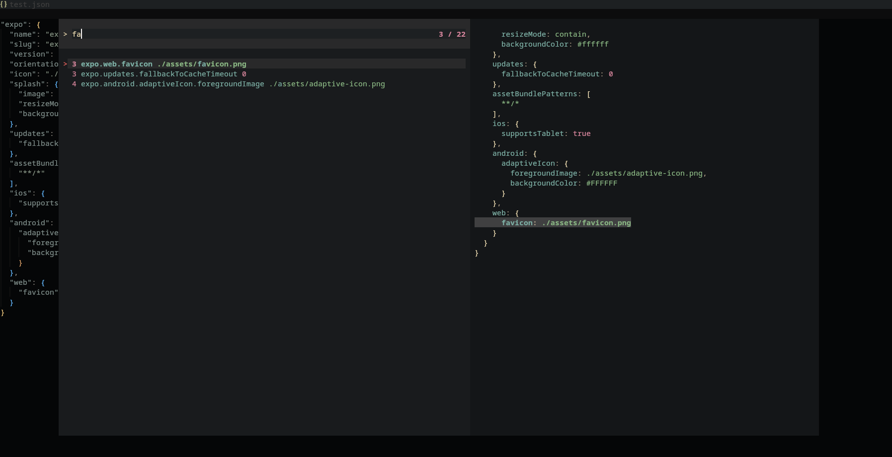
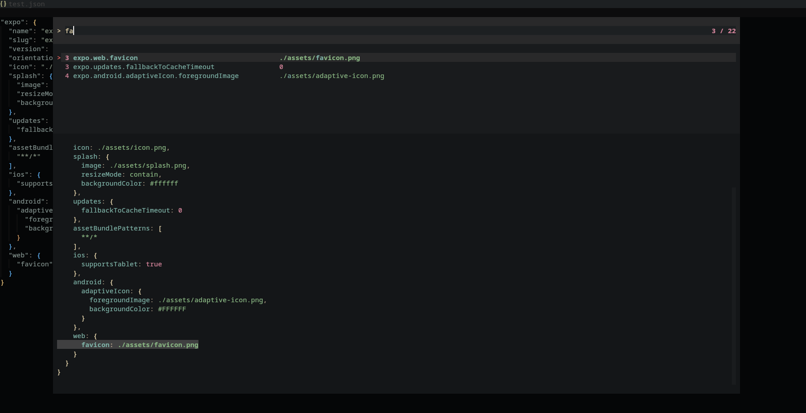
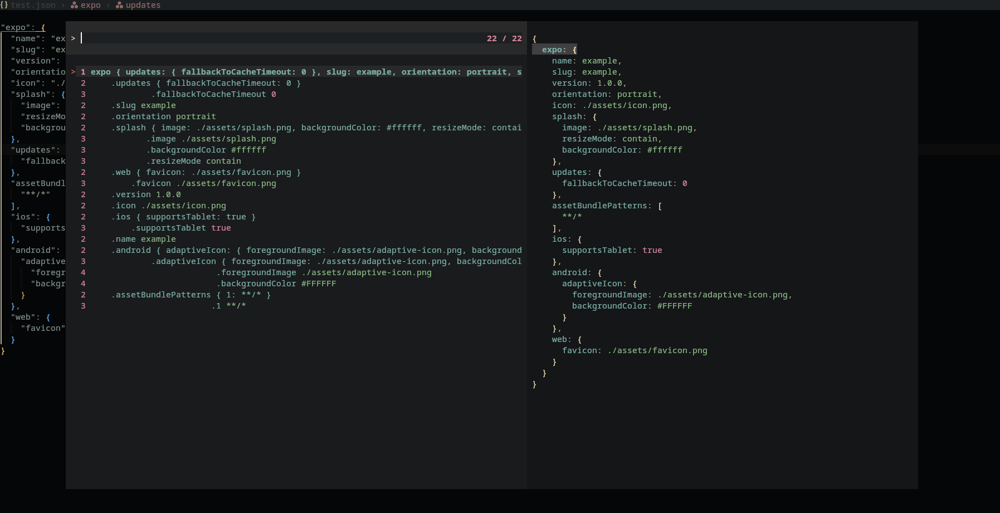

# jsonfly.nvim

Fly through your JSON files with ease. 
Search ✨ blazingly fast ✨ for keys via [Telescope](https://github.com/nvim-telescope/telescope.nvim), and navigate through your JSON structure with ease.

json(fly) is a Telescope extension that will show you all keys (including nested ones) in your JSON files and allow you to search and jump to them quickly.
It's completely customizable and even supports highlighting of the values.



## Features

* 🔍 Search for deeply nested keys - `expo.android.imageAsset.0.uri`
* 🎨 See values with their correct syntax highlighting (numbers, strings, booleans, null; configurable)
* 💻 Use your LSP or the built-in JSON parser
* 🫣 Automatic concealment based on your configuration
* 📐 Everything completely customizable!

## Installation

Install with your favorite plugin manager, for example with [lazy.nvim](https://github.com/folke/lazy.nvim):

```lua
{
    "nvim-telescope/telescope.nvim",
    dependencies = {
        -- "Myzel394/easytables.nvim",
        -- "Myzel394/telescope-last-positions",
        -- Other dependencies
        -- ..
        "Myzel394/jsonfly.nvim",
    }
}
```

Here's how I load it with lazy.nvim with lazy-loading and `<leader>j` as the keymap :)

```lua
{
    "nvim-telescope/telescope.nvim",
    dependencies = {
        "Myzel394/jsonfly.nvim",
    },
    keys = {
        {
            "<leader>j",
            "<cmd>Telescope jsonfly<cr>",
            desc = "Open json(fly)",
            ft = { "json" },
            mode = "n"
        }
    }
}
```

Load the extension with:

```lua
require("telescope").load_extension("jsonfly")
```

## Usage

Go to a JSON file and run:

```lua
:Telescope jsonfly
```

## Configuration

Edit jsonfly like any other Telescope extension:

```lua
require"telescope".setup {
    extensions = {
        jsonfly = {
            -- Your configuration here
        }
    }
}
```

Please see [jsonfly.lua](https://github.com/Myzel394/jsonfly/blob/main/lua/telescope/_extensions/jsonfly.lua) for the default configuration.
The first comment in the file contains a list of all available options.

### Example: Vertical layout



```lua
require"telescope".setup {
    extensions = {
        jsonfly = {
            mirror = true,
            layout_strategy = "vertical",
            layout_config = {
                mirror = true,
                preview_height = 0.65,
                prompt_position = "top",
            },
            key_exact_length = true
        }
    }
}
```

### Example: Horizontal layout


```lua
require"telescope".setup {
    extensions = {
        jsonfly = {
            layout_strategy = "horizontal",
            prompt_position = "top",
            layout_config = {
                mirror = false,
                prompt_position = "top",
                preview_width = 0.45
            }
        }
    }
}
```

### Example: Waterfall keys



```lua
require"telescope".setup {
    extensions = {
        jsonfly = {
            subkeys_display = "waterfall"
        }
    }
}
```

## Acknowledgements

- JSON parsing is done with [Jeffrey Friedl's JSON library](http://regex.info/blog/lua/json)

